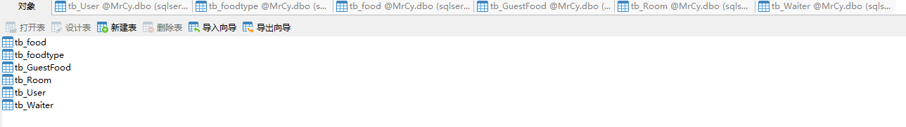
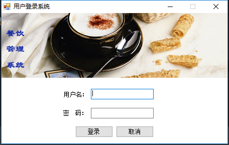
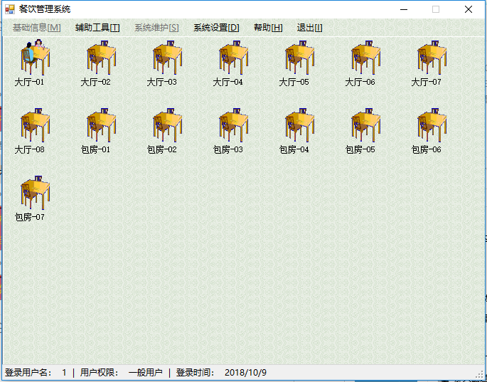
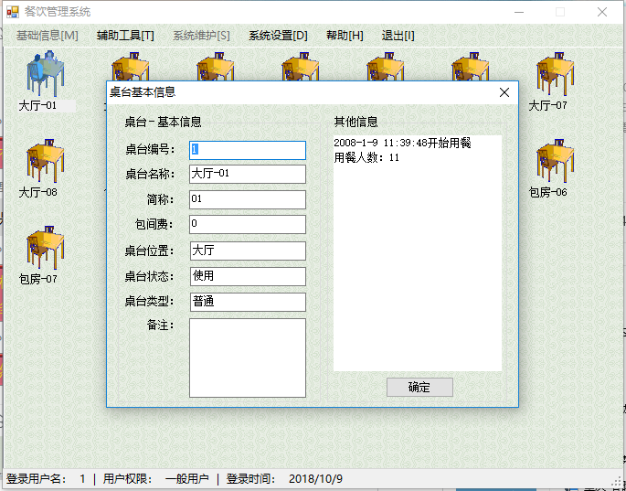
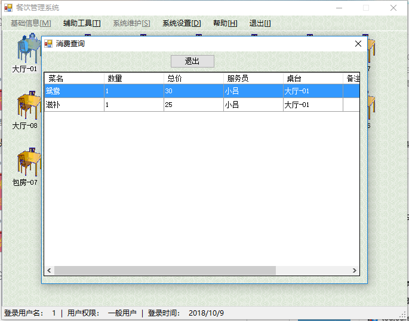
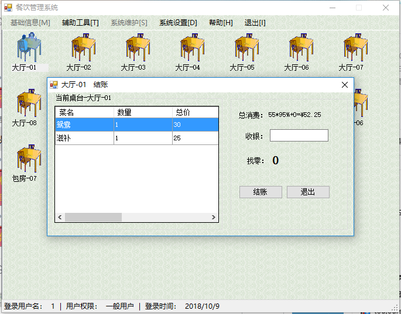
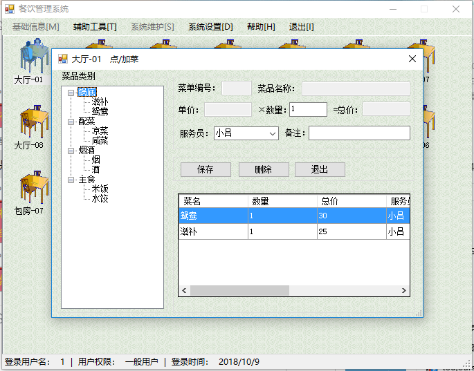

# 餐饮管理系统


# 使用到的软件
- rider2018
- sql server 2017
- Microsoft SQL Server Management Studio 17

# 数据库
默认账号是sa,使用windows验证方式登录修改密码

https://jingyan.baidu.com/article/a501d80c4e3578ec630f5e26.html

# 导入数据库
https://jingyan.baidu.com/article/09ea3ede21258cc0afde3943.html

```
EXEC  sp_attach_db  @dbname  =  'MrCy',     

@filename1  =  'E:\csharp-project\CanYin\MRCY\DATABASE\DB_MRCY_DATA.MDF',     

@filename2  =  'E:\csharp-project\CanYin\MRCY\DATABASE\DB_MRCY_LOG.LDF'
```

# 修改数据库配置文件`DbConn`


# 效果预览
- 数据库    


- 登录    


- 主界面    


- 桌台信息    


- 消费查询    


- 结账


- 点菜    
